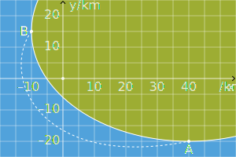
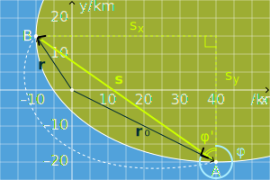
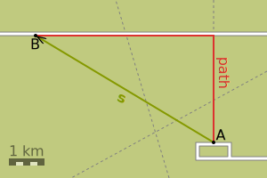

Mechanics, a part of physics dealing with motion of objects, gives answers to two questions: how objects are moving and why they are moving. The first question is addressed by _kinematics_, while the second one – by _dynamics_. We start here with kinematic description of motion.

## Models
As mentioned previously, physics is about models that can be used to describe phenomena occurring in nature in more or less detail. Speaking about the motion of objects, several models can be used.

Consider the motion of the Earth. Looking from the standpoint of the Sun, the Earth is but a tiny speck, which moves around it on a large-scale orbit. If we are to describe this type of motion, the Earth is best modelled as a **point particle**. This model is well applicable when the characteristic size of the object (e. g., the diameter of the Earth) is much smaller than the characteristic size of the motion (e. g. the diameter of the orbit).

If we now focus on a daily rotation of the Earth around its axis, its size can no longer be neglected. What we can neglect, though, are tiny deformations of its shape due to various reasons (tidal effects of the Moon, collisions of tectonic plates, human activity etc.). In this case, the Earth can be modelled as a **rigid body**. This model is applicable when the characteristic size of the object is similar to the characteristic size of the motion, and the deformations of the object are insignificant.

During this year, you will also come across other models, such as a **perfectly elastic body**, a **system of point particles**, an **ideal liquid**, an **incompressible liquid** etc., but for the time being, let us focus on the simplest model of all: the point particle model.

## Position
If there were just a single particle in the whole Universe, it would be hard to tell where exactly this particle was at the given time. The reason is that the space we are living in is uniform, thus the position of any object is _relative_, i. e. it can only be determined with respect to some fixed point.

Suppose we have fixed such a point – an origin $\mathrm{O}$. The position of a particle $\mathrm{P}$ is then uniquely given by a **position vector**
:::{math}
:enumerated: false

\bm{r}=\overrightarrow{\mathrm{OP}}.
:::
In order to simplify visual representation, hereafter, a two-dimensional space will be considered, although all ideas can be directly transferred to the three-dimensional space.

Working with vectors directly is possible, but it is usually easier to introduce a _coordinate system_ and express vectors in components.[^fn:components] The position vector can then be written in terms of its $x$ and $y$ components (cf. ) as
:::{math}
:label: eq:position

\bm{r}=(x,y).
:::

:::{figure} figures/position-vector.svg
:label: fig:position
Position vector $\bm{r}=\overrightarrow{\mathrm{OP}}$ of the particle $\mathrm{P}$, trajectory (red line) and displacement $\bm{s}=\Delta\bm{r}$. The distance $L$ is the length of the trajectory between two points.
:::

## Displacement
If objects did not move, that would be a boring world. Suppose that when we looked at the particle $\mathrm{P}$ for the first time, its position was described by the vector $\bm{r}_0=(x_0,y_0)$. Some time later, the particle has moved to a new position described by the vector $\bm{r}=(x,y)$. We can describe the change in position of the particle (cf. ) using the **displacement vector**
:::{math}
:label: eq:displacement

\bm{s}=\Delta\bm{r}=\bm{r}-\bm{r_0}.
:::

:::{figure} figures/displacement-vector.svg
:label: fig:displacement
Displacement $\bm{s}=\Delta\bm{r}$ of the particle $\mathrm{P}$.
:::

:::{exercise}
:label: ex:displacement

A sailing boat left the port $\mathrm{A}$ and some time later arrived at the port $\mathrm{B}$ (see fig.). Assume that $x$-axis is pointing east and $y$-axis is pointing north.

1. What is the initial position $\bm{r}_0$ and the final position $\bm{r}$ during the trip?
1. Draw the displacement $\bm{s}$ of the boat and express it in components.
1. What is the magnitude of the displacement?
1. What is the direction of the displacement measured clockwise from the north?
:::

::::{solution} ex:displacement
:class: dropdown

Components of vectors $\bm{r}_0$ and $\bm{r}$ are just the coordinates of the port $\mathrm{A}$ and the port $\mathrm{B}$, respectively. Hence,
:::{math}
:enumerated: false

\begin{aligned}
	\bm{r_0}&=(40;-20)\,\mathrm{km},\\
	\bm{r}&=(-10;15)\,\mathrm{km}.
\end{aligned}
:::

Displacement $\bm{s}$ is a vector from the initial point to the final point, i. e. from $\mathrm{A}$ to $\mathrm{B}$, as shown in the figure below, while in components,
:::{math}
:enumerated: false

\begin{aligned}
	\bm{s}&=\bm{r}-\bm{r}_0=(-10;15)-(40;-20)\\
	&=(-50;35)\,\mathrm{km}.
\end{aligned}
:::

Using Pythagoras theorem, the magnitude of the displacement is
:::{math}
:enumerated: false

\begin{aligned}
	s&=\sqrt{s_x^2+s_y^2}=\sqrt{(-50)^2+35^2}\\
	&=61\,\mathrm{km}.
\end{aligned}
:::

The direction of $\bm{s}$ can be determined as follows. Consider a right-angle triangle with the legs $s_x$, $s_y$ and the hypotenuse $s$. The angle $\varphi'$ adjacent to the leg $s_y$ can be conveniently expressed from its tangent:
:::{math}
:enumerated: false

\begin{gathered}
	\tan\varphi'=\frac{|s_x|}{|s_y|},\\
	\begin{aligned}
		\varphi'&=\arctan\frac{|s_x|}{|s_y|}=\arctan\frac{50}{35}\\
		&=55^\circ.
	\end{aligned}
\end{gathered}
:::
Hence, $\varphi=360^\circ-\varphi'=305^\circ$.
::::

## Path and distance
The previous section only focused on two positions of an object, but the motion between these two positions might have happened in various ways. The line (curved or straight) along which an object has been moving is called the **path**, and the length of the path between two given points is the **distance** $L$ (see @fig:path-distance).

:::{figure} figures/path-distance.svg
:label: fig:path-distance
Path of the particle $\mathrm{P}$ (red) and the distance $L$ between two points.
:::

Note that distance is a scalar quantity: In contrast to displacement, it does not have an associated direction. Also note that the distance between two points is never less than the magnitude of displacement between them, as the shortest distance between two points is along a straight line.

:::{exercise}
:label: ex:path-distance

A group of students went on a hike. They walked $3{,}0\,\mathrm{km}$ due north on a trail, then turned on a paved road that runs due west and walked $5{,}0\,\mathrm{km}$ more.

1. Draw the path and the displacement of the students to scale.
1. What distance did students cover during the hike?
1. What was their overall displacement (magnitude)?
1. How would your answer to the previous question change if the distances of the segments were the same, but the paved road ran northwest?  
:::

::::{solution} ex:path-distance
:class: dropdown

Distance is _additive_, meaning that the total covered distance is just the sum of distances covered in each segment. Hence,
:::{math}
:enumerated: false
	L=L_1+L_2=3{,}0+5{,}0=8{,}0\,\mathrm{km}.
:::

Displacement $s$ is the hypotenuse in a right-angle triangle shown in the figure, hence according to Pythagoras theorem
:::{math}
:enumerated: false
	\begin{aligned}
		s&=\sqrt{L_1^2+L_2^2}
		=\sqrt{3{,}0^2+5{,}0^2}\\
		&=5{,}8\,\mathrm{km}.
	\end{aligned}
:::

If the road ran northwest instead of west, the angle between two segments of the hike would change from $90^\circ$ to $135^\circ$. Pythagoras theorem in this case is no longer applicable, so we need to use a more general law of cosines:
:::{math}
:enumerated: false
	\begin{aligned}
	 s&=\sqrt{L_1^2+L_2^2-2L_1L_2\cos\theta}\\
	 &=\sqrt{3{,}0^2+5{,}0^2-30\cos135^\circ}\\
	 &=7{,}4\,\mathrm{km}.
	\end{aligned}
:::
::::

## Velocity and speed
Describing a path still does not give us the whole information about the motion. We do know which points the object passed on its way, but we do not yet know when that happened: Our description lacks time.

Consider the object in @fig:path-distance. Let's say that it moved from the initial position to the current position (point $\mathrm{P}$) in time $\Delta t$. We can now introduce two quantities that describe how fast the object was moving. One of these quantities is the average **velocity**
:::{math}
:label: eq:avg-velocity
	\bm{v}_{\mathrm{avg}}=\frac{\bm{s}}{\Delta t}=\frac{\Delta\bm{r}}{\Delta t},
:::
which is a _vector_, whereas the other quantity, the average **speed**
:::{math}
:label: eq:avg-speed
	v_{\mathrm{avg}}=\frac{L}{\Delta t}
:::
is a _scalar_. The SI unit of both average velocity and average speed is
:::{math}
:enumerated: false
	\begin{aligned}
		[\bm{v}_\mathrm{avg}]&=\frac{[\bm{s}]}{[\Delta t]}=\mathrm{\frac{m}{s}},\\
		[v_\mathrm{avg}]&=\frac{[L]}{[\Delta t]}=\mathrm{\frac{m}{s}}.
	\end{aligned}
:::

Suppose we are now interested in the **instanteneous** speed $v$ of the object (i. e. its speed ‘right now’) to be shown, say, on the display of the speedometer. To determine it, we follow the procedure described in [Sec. Derivatives](#sec:derivatives) from the _Mathematical Background_.

:::{exercise}
:label: ex:avg-speed-velocity

The group of students from @ex:path-distance covered the trail part of their route in $t_1=1{,}0\,\mathrm{h}$ and the paved-road part in $t_2=1{,}2\,\mathrm{h}$. They walked $3{,}0\,\mathrm{km}$ due north on a trail, then turned on a paved road that runs due west and walked $5{,}0\,\mathrm{km}$ more.

1. Draw the path and the displacement of the students to scale.
1. What distance did students cover during the hike?
1. What was their overall displacement (magnitude)?
1. How would your answer to the previous question change if the distances of the segments were the same, but the paved road ran northwest?  
:::

## Acceleration

[^fn:components]: Strictly speaking, components, coordinates and projections of a vector (say, $\bm{v}$) are different things. Components $\bm{v}_x$, $\bm{v}_y$, $\bm{v}_z$ are the _vectors_ that are parallel to the axes and add up to the given vector, i. e. $\bm{v}=\bm{v}_x+\bm{v}_y+\bm{v}_z$. Projection $v_x$, $v_y$ or $v_z$ is the (signed) length of the directed segment, the endpoints of which are the intersections of the corresponding axis and perpendiculars to it that contain the endpoints of the vector; hence projections are _scalars_. Coordinates are also _scalars_, but are defined differently. Suppose we choose three vectors $\bm{e}_1$, $\bm{e}_2$ and $\bm{e}_3$, each in the direction of the corresponding axis (a so called _basis_). Then an arbitrary vector $\bm{v}$ can be uniquely expressed as $\bm{v}=v_1\bm{e}_1+v_2\bm{e}_2+v_3\bm{e}_3$, where $v_1$, $v_2$ and $v_3$ are the coordinates of the vector in given basis. In high-school physics, only Cartesian orthonormal coordinate system is considered, where corresponding projections and coordinates are equal, and – colloquially – all three terms may be used interchangeably.
