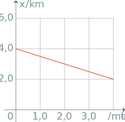

Consider a train moving on a long straight track. This is an example of a one-dimensional motion, as we need only one coordinate, say, $x$ to uniquely identify the position of the train on the track (). Suppose the train was initially at the point with $x=x_0$ and is moving with a constant velocity $v_x$. After time $t$ has elapsed, the train has moved forward from $x_0$ by $v_xt$, hence its position at time $t$ is
:::{math}
:label: eq:uniform-motion
	x(t)=x_0+v_xt.
:::
This, by definition, is the equation of a uniform (rectilinear) motion.

:::{figure} figures/train-on-track.svg
:label: fig:train-on-track

Position of a train on a straight track can be identified by one coordinate, hence its motion is one-dimensional.
:::

::::{exercise}
:label: ex:equation-uniform-motion

A particle is moving along the $x$ axis so that its equation of motion, in SI units, is
:::{math}
:enumerated: false
	x(t)=2{,}0+0{,}10t.
:::

1. What was the initial coordinate of the particle?
1. What is its velocity?
1. Is the particle moving in the positive or in the negative direction of the axis?
1. What is the speed of the particle?
1. What is the displacement of the particle in the first $\tau=5{,}0\,\mathrm{s}$?
::::
::::{solution} ex:equation-uniform-motion
:class: dropdown

Consider the general form of the equation of uniform motion . Here, the free term is the initial coordinate $x_0$, while the quantity multiplied by time $t$ is the velocity $v_x$. In the equation from the exercise, the free term is $2{,}0$ and the time is multiplied by $0{,}10$. Hence, restoring SI units for the quantities, we get that $x_0=2{,}0\,\mathrm{m}$ and $v_x=0{,}10\,\mathrm{m\,s^{-1}}$.

The direction of motion is determined by the sign of the velocity. Here $v_x>0$, hence the particle is moving in the positive direction of the axis.

The speed is the magnitude of the velocity. In one-dimensional case here, $v=|v_x|=2{,}0\,\mathrm{m\,s^{-1}}$.

The displacement by definition is
:::{math}
:enumerated: false

\begin{aligned}
	s_x&=x-x_0=x(\tau)-x_0\\
	&=x_0+v_x\tau-x_0=v_x\tau\\
	&=0{,}10\cdot5{,}0=0{,}50\,\mathrm{m}.
\end{aligned}
:::

:::{note}
Strictly speaking, velocity is a vector, and $v_x$ is a component of this vector along the $x$ axis. In the case of a one-dimensional motion, however, velocity vector $\bm{v}=(v_x)$ has only one component, so, colloquially, we might call $v_x$ a velocity as well. Same argument holds for other vectors (displacement, acceleration, etc.) in one dimension.
:::
::::

## Graphs of uniform motion

According to , the coordinate $x$ of an object in the uniform motion is a linear function of time, so $x(t)$ graph is a straight line. The ordinate-intercept of this line is the initial coordinate of the object, while the slope is its velocity $v_x$. As the velocity is constant during the motion, the $v_x(t)$ graph is a straight line parallel to the $t$-axis.

:::{figure} figures/uniform-x-t.svg
:label: fig:uniform-motion

Graphs of the coordinate $x$ (left) and the velocity component $v_x$ (right) as a function of time in uniform motion. Velocities satisfy $v_{1x}>v_{2x}>0>v_{3x}$.
:::

::::{exercise}
:label: ex:uniform-graph

A cyclist is riding a bicycle on a straight level north–south road so that his coordinate $x$ changes with time $t$ as shown in the plot below. Assume the $x$ axis is pointing due North.

1. What was the initial coordinate of the cyclist?
1. What is his velocity?
1. Is the cyclist moving south or north?
1. What is the speed of the cyclist?
1. What is his displacement from $t_1=1{,}0\,\mathrm{min}$ until $t_2=3{,}0\,\mathrm{min}$?
::::
::::{solution} ex:uniform-graph
:class: dropdown

The initial coordinate is nothing else but the coordinate at time $t=0$, which can be read from the graph directly: $x_0=x(0{,}0\,\mathrm{min})=4{,}0\,\mathrm{km}$.

The velocity $v_x$ can be determined as the slope of the $x(t)$ graph. Let’s choose two points on that graph, the further apart the better, for which the values of $x$ and $t$ are easy to read, e. g.
:::{math}
:enumerated: false
\begin{gathered}
	(t_0=0{,}0\,\mathrm{min};x_0=4{,}0\,\mathrm{km}),\\
	(t_1=4{,}0\,\mathrm{min};x_1=2{,}0\,\mathrm{km}).
\end{gathered}
:::
The slope, and hence the velocity, is then
:::{math}
:enumerated: false
\begin{aligned}
	v_x&=\frac{x_1-x_0}{t_1-t_0}=\frac{2{,}0-4{,}0}{4{,}0-0{,}0}\\
	&=-0{,}50\,\mathrm{km\,min^{-1}}.
\end{aligned}
:::
or $-30\,\mathrm{km\,h^{-1}}$ if you wish. The latter conversion is not necessary, but is a good validity check of your result. A cyclist can easily go $30\,\mathrm{km\,h^{-1}}$, so the result looks at least plausible.

:::{note}
There are two validity checks that you are advised to perform at the end of any problem.

The first one is whether the result seems reasonable, like in the example above. The result of this kind of check will depend greatly on your prior experience. You most surely will identify that there is a mistake if you get that a person is running at $200\,\mathrm{m\,s^{-1}}$ or if the volume of a bucket is $5\,\mathrm{m\ell}$. On the other hand, in some cases the judgement can be tricky, e. g. can a mosquito beat its wings 500 times a second? or is $120\,\mathrm{atm}$ gas pressure possible during the production of ammonia? In such cases, the check does not give you a decisive result. (By the way, the answer to both questions is ‘yes’.)

The second aspect to check is whether the unit (or _dimension_ if you wish) of the result matches the expected one. Suppose you (incorrectly) used that the speed $v=Lt$. The SI unit for the left-hand side of this equality is the unit of speed, i. e. $[v]=\mathrm{m\,s^{-1}}$. The unit of the right-hand side, however is $[L][t]=\mathrm{m\,s}$. As the units on both sides of the equality do not match, there must have been a mistake in algebra. This kind of check becomes increasingly more important as expressions become longer and more complicated.
:::

The direction of motion is determined by the sign of the velocity. Here $v_x<0$, hence the cyclist is moving in the negative direction of the axis, i. e. south.

The speed is the magnitude of the velocity. In one-dimensional case here, $v=|v_x|=0{,}50\,\mathrm{km\,min^{-1}}$.

The displacement in the uniform motion is
:::{math}
:enumerated: false
\begin{aligned}
	s_x&=v_x(t_2-t_1)\\
	&=-0{,}50\cdot(3{,}0-1{,}0)\\
	&=-1{,}0\,\mathrm{km},
\end{aligned}
:::
i. e. $1{,}0\,\mathrm{km}$ south from the starting point. The same result could have been obtained from the graph as the difference $x(t_2)-x(t_1)$, but in this case these two values are not that easy to read from the graph (they do not fall on the grid lines), so you can get a better precision by using algebra.
::::